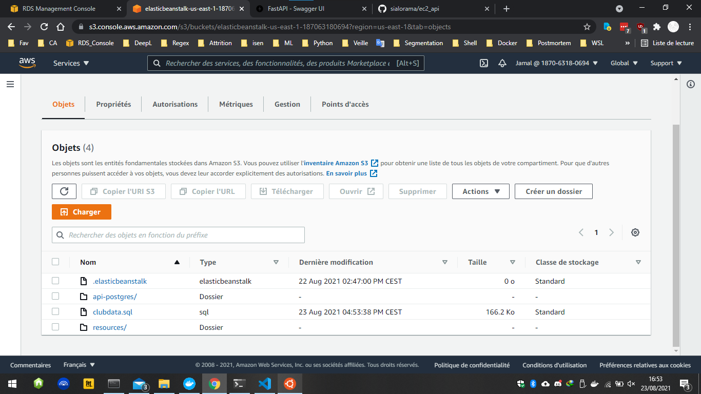
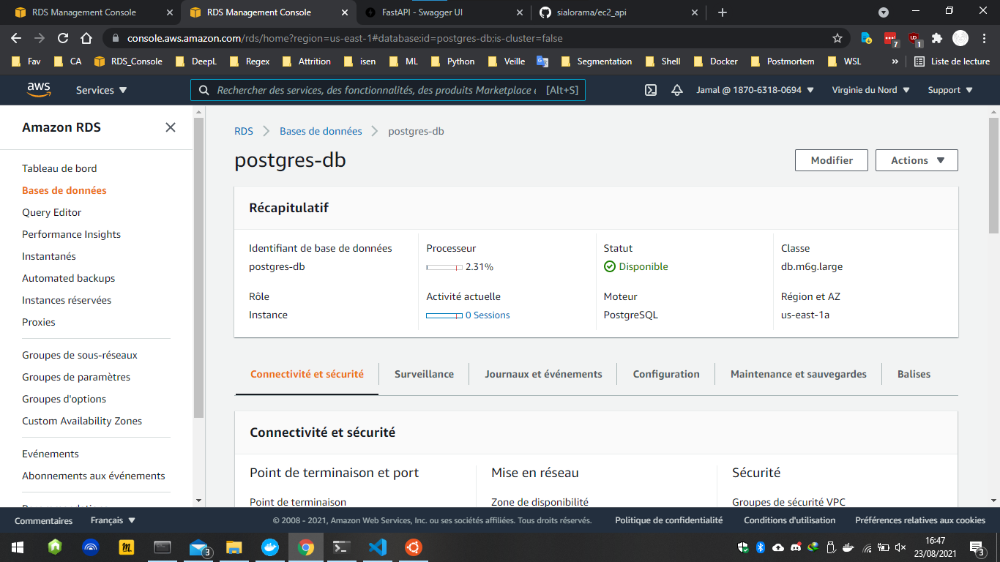
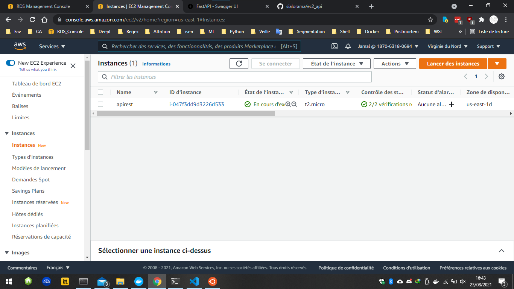
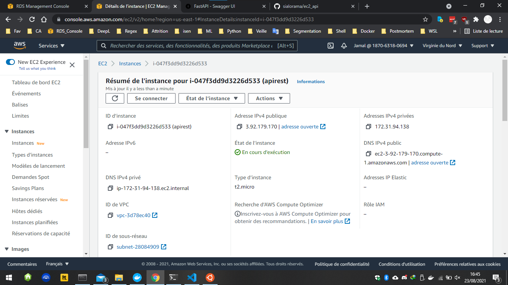
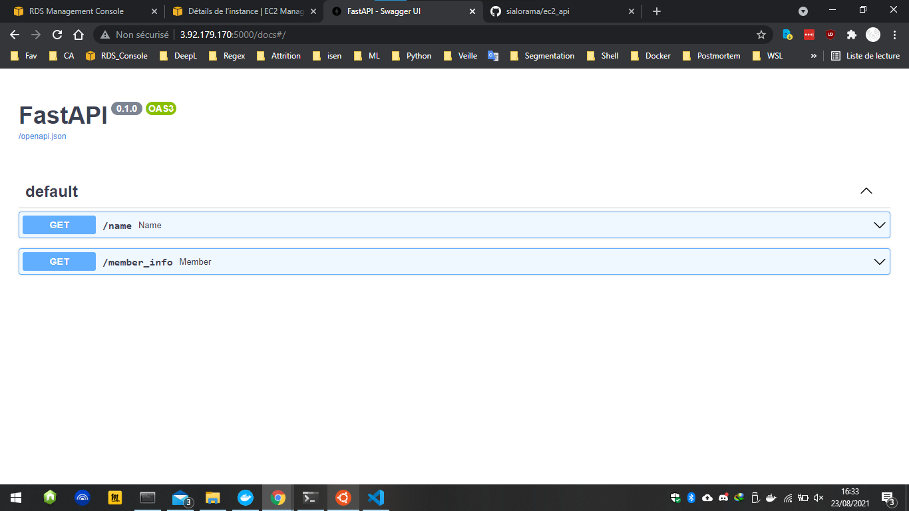
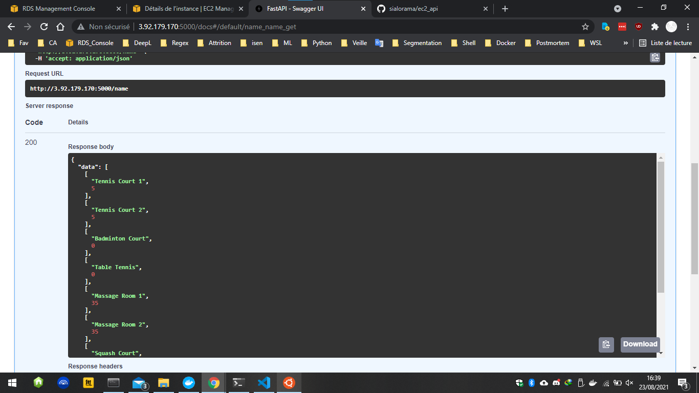
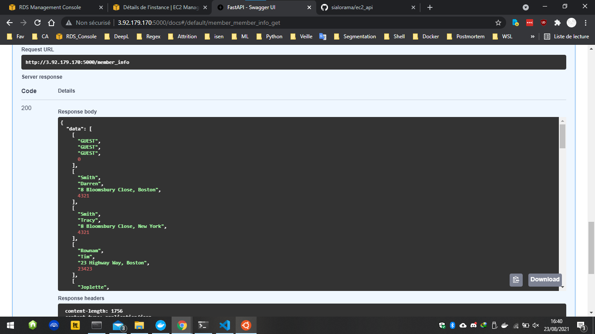

# Mise en place d'une API sur AWS EC2 cinnectée à une DB Postgres sur AWS RDS  

Nous réaliserons un infrastructure dans le cloud en utilisant les services EC2, RDS et S3 d'amazon.  
NB : J'utilise Windows comme OS principal, et Ubuntu sous WSL pour les commande SSH.  

## 1.Création de la base de données (postgres-db) sur RDS:  

### Créer les deux contenaires Postgres_db et Pg_admin:  
Utilisez le docker-compose.yml pour créer le contenaire:  
  ```docker-compose up```
  ```code
version: '3.8'

services:

  db:
    image: postgres
    container_name: postgres-db
    restart: always
    environment:
      POSTGRES_USER: postgres
      POSTGRES_PASSWORD: rtyfghrtyfgh
    volumes:
       - ./data:/var/lib/postgresql/data
    ports:
      - 5432:5432

  pgadmin:
    image: dpage/pgadmin4
    container_name: Pg_admin
    links:
      - db
    depends_on:
      - db
    environment:
      PGADMIN_DEFAULT_EMAIL: admin@admin.com
      PGADMIN_DEFAULT_PASSWORD: pwdpwd
    volumes:
      - ./pgadmin:/var/lib/pgadmin
    ports:
      - 8080:80
```

Une fois le contenaire lancé, copiez dessus le fichier clubdata.sql disponible [ici](https://pgexercises.com/dbfiles/clubdata.sql) avec la commande :  
  ```> docker cp clubdata.sql postgres-db:/clubdata.sql```  
Il vous faut à présent copier le fichier sql sur AWS RDS, cela crée la base de données "Exercises":  
  ```> psql -U postgres -f clubdata.sql -h <Point de terminaison RDS> -x -q```  
vous pouvez consulter les tables en utilisant le container de Pg_Admin:  
lien : localhost:80  
id : admin@admin.com  
password : pwdpwd  

## 2. Création de l'instance EC2: [lien](https://aws.amazon.com/fr/ec2/?nc2=h_ql_prod_fs_ec2&ec2-whats-new.sort-by=item.additionalFields.postDateTime&ec2-whats-new.sort-order=desc)  

  Une fois l'instance est fonctionnelle, il faudra créer une paire de clé pem. Ensuite lancez ubuntu WSL et saisissez les commandes suivantes pour pouvoir accéder en SSH à l'instance EC2 créée.  
  ```
 ~$ chmod 400 my_pair_keyf.pem
 ~$ ssh -i maclef.pem ec2-user@ec2-3-92-179-170.compute-1.amazonaws.com
 ```
 - Mettez à jour la distribution linux installée du EC2  
 - Lancez Docker  
 - installez git et clonez le répértoire contenant l'API sur ec2-user.  
 ```
 [ec2-user@ip-172-31-94-138 ~]$ sudo yum update -y
 [ec2-user@ip-172-31-94-138 ~]$ sudo service docker start
 [ec2-user@ip-172-31-94-138 ~]$ sudo yum install git -y
 [ec2-user@ip-172-31-94-138 ~]$ git clone https://github.com/sialorama/ec2_api.git
 ```
 
 ## 3. Lancement de l'API:  
 Saisissez les commandes suivantes pour charger l'API:  
 
 ```
   [ec2-user@ip-172-31-94-138 ec2_api]$ sudo docker build -t api:latest .
   [ec2-user@ip-172-31-94-138 ec2_api]$ sudo docker run -p 5000:5000 api
 ```
 ## 4. Résultat:  
 
   
   
   
   
   
   
   
